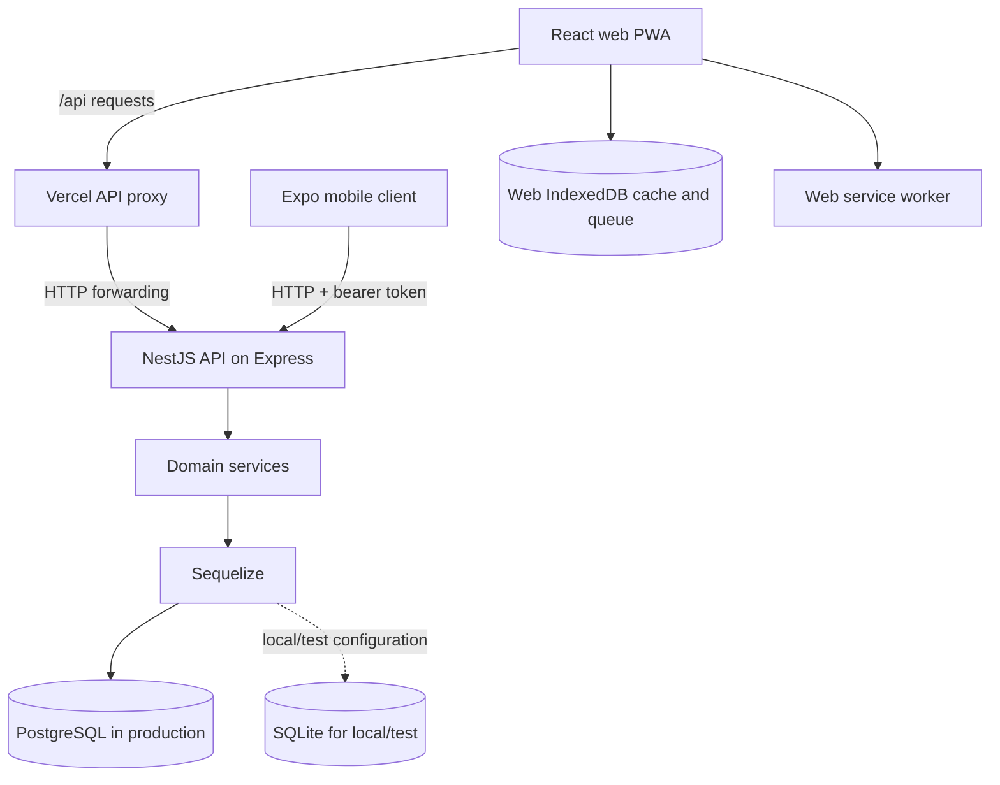
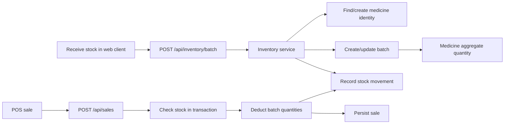
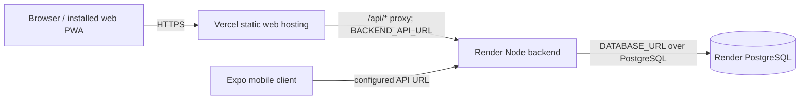

# MediQuick Architecture

## 1. System overview

MediQuick consists of a canonical API, a React web/PWA client and an Expo mobile client. The backend owns persisted operational records and business rules. Production persistence is PostgreSQL; SQLite is used by local development and tests. The web PWA can retain selected data and pending operations in IndexedDB when connectivity is unavailable. The mobile client currently provides a smaller, online inventory/POS experience.

The checked-in web deployment uses a Vercel serverless proxy for `/api/*` requests to the backend. The Render configuration describes the backend and PostgreSQL service. Actual deployed instances and their availability are not verifiable from repository files.

## 2. High-level architecture



For local web development, `REACT_APP_API_BASE_URL` points directly to the API (typically port `5001`). In production web, same-origin `/api/*` requests are rewritten to `api/index.js`; that handler forwards them to `BACKEND_API_URL` (or its configured fallback).

## 3. Frontend architecture

### Web client

`pharmacy-inventory/src` is a React 19/Create React App application. `App.js` defines routes and role-based UI gating; shared application data and web auth state live in `context/DataContext.js`. Resource pages include dashboard, inventory, stock receiving, POS, reports, profit/loss, prescriptions, users, expenses, suppliers and customers.

`utils/api.js` builds requests and attaches the stored bearer token. `utils/offlineDb.js` stores selected inventory, customers, recent sales, pending operations and sync metadata in IndexedDB. `utils/syncEngine.js` monitors connectivity and submits operations to the backend `/api/sync` endpoint. The service worker caches an application shell/static resources and uses a network-first navigation fallback; it does not cache API data.

Stock/invoice capture has browser OCR support using Tesseract.js and PDF.js. A prescription OCR flow was not verified.

### Mobile client

`pharmacy-mobile/app` uses Expo Router. Current top-level routes include login and tabs for inventory, POS and profile. `api/client.ts` uses Axios and adds a bearer token retrieved from Expo SecureStore. `context/AuthContext.tsx` manages the mobile session. The repository does not confirm parity with the web client for all resource pages or offline queueing.

## 4. Backend architecture

`pharmacy-backend/server/src/main.js` creates the Nest application with the Express adapter, configures CORS, readiness/migrations and the API fallback. `src/app.module.js` registers resource controllers and services. Controllers declare route paths and guards; services implement validation, database operations and business rules.

Major modules include auth, inventory, sales, customers, prescriptions, suppliers, expenses, analytics/reports, audit logging and sync. Sequelize models are under `server/models`; migrations are under `server/migrations`. The `pharmacy-inventory/server` tree is legacy and is not the canonical API.

## 5. Database architecture

Sequelize connects to PostgreSQL in production using `DATABASE_URL`. Production startup rejects SQLite and requires a PostgreSQL URL. Local/test environments may use SQLite. Model associations and schema history are documented in the [Database ERD](database-erd.md).

Important data behavior:

- Medicine records have one text `category`; there is no separate category/subcategory entity.
- A medicine can have multiple batches. Batch quantities are the underlying stock records.
- Sales link to a medicine, optionally to a single batch (when one batch suffices) and optionally to a customer.
- Sales spanning multiple batches retain a nullable single `batchId`; per-batch deductions are represented by `InventoryMovements`.
- Movement history can remain after a medicine/batch is removed because the related movement foreign keys are nullable and configured to set null on deletion.
- `AuditLogs.userId` is a recorded identifier; a Sequelize association to `Users` is not declared in the model index.

## 6. Authentication and authorization flow

```mermaid
sequenceDiagram
    participant Client as Web or mobile client
    participant API as Canonical API
    participant Auth as Auth service/guards
    participant DB as Database

    Client->>API: POST /api/auth/login (username, password)
    API->>Auth: Normalize username and verify password
    Auth->>DB: Load account
    DB-->>Auth: User and account status
    Auth-->>Client: Signed bearer token and serialized user
    Client->>API: Protected request + Authorization: Bearer token
    API->>Auth: Verify signature/expiry; load active user
    Auth->>Auth: Enforce route role and permission
    Auth-->>API: Authorized request context
```

Passwords are hashed with Node's `scrypt` implementation. Access tokens are signed using HMAC-SHA256 with `JWT_SECRET` and expire after `JWT_EXPIRES_IN_HOURS` (default 12). Protected requests reload the user, reject missing/inactive accounts and enforce password-change requirements. Route-level roles/permissions are enforced by backend guards. The web client also applies role-aware route rendering, which is not a security boundary.

Web session data is stored in `localStorage`; mobile stores session/token data through Expo SecureStore. Do not treat either client session store as a trusted authorization source.

## 7. Inventory workflow



The inventory API includes paginated medicine listing, low-stock listing, batch receiving, medicine creation/update/deletion and movement history. Batch receiving records batch-specific expiry date, quantity and pricing. The backend uses a normalized product identity and database uniqueness constraints to help prevent duplicate products/batches; legacy ambiguous medicine records are not silently merged.

The exact category value is a string on a medicine. No category management or subcategory route/entity was found.

## 8. Sales/POS workflow

The web POS builds sale data and submits it to `/api/sales`. The backend validates positive whole-number quantities, non-negative sale totals, product identity and stock. It locks/updates batches in expiry-date order, writes sales and negative stock movements in a database transaction, and updates medicine aggregate quantity. A supplied `clientTransactionId` provides retry/idempotency support. The mobile POS currently creates online sales with a cash payment label.

The web PWA can store supported pending `SALE` operations locally and replay them at `/api/sync`. Sync requires a client transaction ID and checks operation permissions, idempotency and server stock; conflicts/failures are returned per operation. Local optimistic data is not authoritative.

## 9. Batch and expiry workflow

Batches belong to a medicine and contain `batchNumber`, quantity, expiry date, cost/selling price and optional supplier, warehouse, invoice and received-date data. The migration adds a unique `(medicineId, batchNumber)` key. Sales consume batches in ascending expiry-date order. The repository confirms expiry-risk analytics, but it does not prove a universal prohibition against selling expired stock; do not claim one.

`InventoryMovements` records purchase/restock, sale and adjustment changes. The API exposes movements by medicine. Offline sync supports sale, restock/add-batch and adjustment operations.

## 10. Reporting workflow

- `GET /api/analytics/profit-loss` aggregates sales revenue, cost of goods sold and expenses by month.
- `GET /api/analytics/predictions` generates a demand forecast from sales history and current inventory.
- `GET /api/analytics/reorder-suggestions` returns suggested restocking data.
- `GET /api/analytics/risks` returns stockout, expiry and dead-stock insight sets.
- `GET /api/reports/analytics` calls the same profit/loss service as the profit-loss endpoint.

The web reports page also groups the loaded sales data into a daily ledger and stores daily shortage entries in local storage. This is client-side state, not a persisted backend report entity.

## 11. External integrations

Confirmed repository-level integrations/configuration:

- Vercel serverless API proxy and URL rewrites for the web client.
- Render backend/PostgreSQL blueprint.
- Tesseract.js and PDF.js in web stock/invoice intake.
- Browser IndexedDB and service worker for the web PWA.
- Expo SecureStore for mobile session storage.

`firebase-admin` and Firebase-related configuration files exist in the backend dependency/configuration tree, but an active Firebase runtime workflow was not confirmed in the canonical API. Payment processor, e-prescribing, insurer and external pharmacy-system integrations are not currently documented/verified.

## 12. Deployment architecture



The checked-in `render.yaml` describes a Render web service and database and runs migrations as part of its build command. `pharmacy-inventory/vercel.json` routes API requests to the local proxy function and other routes to the SPA entry. CORS is configured by backend environment variables. These files document intended configuration, not the current state of any live deployment.

A root Dockerfile and `pharmacy-inventory/docker-compose.yml` also exist as alternate deployment assets. Their operational use is not confirmed. Mobile store/build/signing deployment is not currently documented/verified. See [Deployment](deployment.md).

## 13. Data flow summary

1. A staff member signs in; clients receive a bearer token and attach it to protected API requests.
2. Client pages read/write through the canonical API; the backend applies guards and service-level validation.
3. Services use Sequelize to read or transactionally modify PostgreSQL (or local/test SQLite).
4. Inventory changes update batch quantities and movement history; sale lines preserve sales/customer references.
5. Web offline-capable operations are cached/queued in IndexedDB and later reconciled with the API; server state wins.
6. Analytics derive outputs from persisted sales, expenses, batches and inventory. Some presentation reports are additionally aggregated client-side.

## API and access matrix

All API paths below are rooted at the same host. Except `POST /api/auth/login`, `/health`, protected `/api/auth` operations require a bearer token. Roles and permissions are enforced by backend guards as summarized below.

| Method | Path | Purpose | Access notes |
|---|---|---|---|
| `GET` | `/health` | Readiness status | No route auth guard |
| `POST` | `/api/auth/login` | Sign in | Public |
| `POST` | `/api/auth/change-password` | Change current password | Authenticated; permitted during required password-change state |
| `GET` | `/api/auth/me` | Current user | Authenticated |
| `GET`, `POST`, `PUT`, `PATCH`, `DELETE` | `/api/auth/users[/:id]`, `/api/auth/users/:id/status` | User management | Admin role and users permissions |
| `GET`, `POST` | `/api/inventory` | List/create medicine | Inventory read/write permission |
| `GET` | `/api/inventory/low-stock` | Low-stock products | Inventory read permission |
| `GET` | `/api/inventory/:id/movements` | Movement history | Inventory read permission |
| `POST` | `/api/inventory/batch` | Add stock batch | Inventory write permission |
| `PUT`, `DELETE` | `/api/inventory/:id` | Update/delete medicine | Inventory write permission |
| `GET`, `POST` | `/api/sales` | List/create sales | Sales read/write permission |
| `GET`, `POST` | `/api/customers` | List/create customers | Admin/manager role plus customer permissions |
| `GET` | `/api/customers/search`, `/api/customers/:id` | Search/get customer | Admin/manager role plus customer read permission |
| `GET`, `POST`, `PUT` | `/api/prescriptions`, `/api/prescriptions/:id/status` | List/create/update prescription status | Admin/manager role plus prescription permissions |
| `GET`, `POST`, `PUT`, `DELETE` | `/api/suppliers[/:id]` | Supplier records | Admin/manager role plus supplier permissions |
| `GET`, `POST`, `PUT`, `DELETE` | `/api/expenses[/:id]` | Expense records | Admin/manager role plus expense permissions |
| `GET` | `/api/analytics/profit-loss` | Monthly financial summary | Admin/manager role plus analytics read permission |
| `GET` | `/api/analytics/predictions` | Forecast output | Admin/manager role plus analytics read permission |
| `GET` | `/api/analytics/reorder-suggestions` | Reorder suggestions | Admin/manager role plus analytics read permission |
| `GET` | `/api/analytics/risks` | Stockout/expiry/dead-stock data | Admin/manager role plus analytics read permission |
| `GET` | `/api/reports/analytics` | Profit/loss report alias | Admin/manager role plus analytics read permission |
| `POST` | `/api/sync` | Reconcile offline operations | Authenticated; per-operation permissions checked by sync service |

The user-management path family includes `GET/POST /api/auth/users`, `PUT/DELETE /api/auth/users/:id` and `PATCH /api/auth/users/:id/status`. Selected list routes use pagination (`page`, `limit`; default 25, maximum 100) and return `{ data, pagination }`; response envelopes vary across routes. No OpenAPI specification was found.
