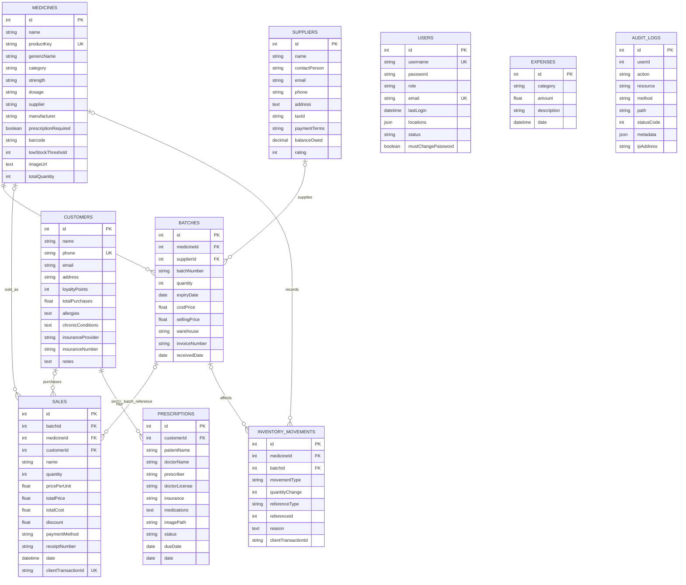

# MediQuick Database ERD

## Scope and source of truth

This diagram reflects Sequelize model associations and checked-in migrations in `pharmacy-backend/server`. It is a logical overview, not a complete column-by-column schema export. Production uses PostgreSQL; SQLite is used for local development and tests.

`createdAt` and `updatedAt` are Sequelize-managed timestamps on the defined models unless noted otherwise. Actual physical columns/indexes should be checked against migrations and the target database before schema changes.

## Entity relationship diagram

## Entity notes

| Entity | Confirmed purpose and important details |
|---|---|
| `Users` | Staff account, hashed password, role (`admin`, `manager`, `user`), status, locations and password-change flag. |
| `Medicines` | Product identity and catalog fields. `category` is a text field; no separate categories or subcategories table is present. `totalQuantity` is an aggregate maintained by inventory/sales logic. |
| `Batches` | Stock quantity and expiry/pricing/receiving details for one medicine. A unique index protects `(medicineId, batchNumber)`. |
| `InventoryMovements` | Quantity delta and movement/reference metadata; optional medicine/batch association; optional client transaction ID for sync. |
| `Sales` | Sale line/record with quantities, totals, costs, payment method, optional customer/product/batch references and optional client transaction ID. A sale drawing from multiple batches can have a null direct `batchId`; corresponding movements retain per-batch changes. |
| `Customers` | Contact and optional loyalty, insurance, allergy, chronic-condition and notes fields. Phone is unique when present. |
| `Prescriptions` | Patient/prescriber information, medication text, optional customer, image path, due date and enumerated status. This schema alone does not establish a complete dispensing workflow. |
| `Suppliers` | Supplier contact and account-summary fields. Batch records can refer to a supplier. |
| `Expenses` | Operational expense category, amount, description and date. No direct user relation is modeled. |
| `AuditLogs` | Intercepted request/action metadata, with a nullable `userId` value. No declared ORM association or foreign-key constraint to `Users` was found. |

## Relationships and deletion behavior

- `Medicine.hasMany(Batch)` / `Batch.belongsTo(Medicine)`. Deleting a medicine is configured to cascade to its batches.
- `Supplier.hasMany(Batch)` / `Batch.belongsTo(Supplier)`. The migration configures the batch supplier reference to become null if the supplier is deleted.
- `Medicine.hasMany(Sales)` and `Sales.belongsTo(Medicine)`.
- `Batch.hasMany(Sales)` and `Sales.belongsTo(Batch)`. The sale's batch reference is nullable for legacy sales and multi-batch sales.
- `Customer.hasMany(Sales)` and `Sales.belongsTo(Customer)`.
- `Customer.hasMany(Prescription)` and `Prescription.belongsTo(Customer)`.
- `Medicine` and `Batch` each have many `InventoryMovements`; their movement references are nullable and configured to become null on deletion.
- No ORM relationships are declared for `Users`, `Expenses` or `AuditLogs`. `AuditLogs.userId` is metadata, not a verified relational association.

## Integrity and migration notes

- Migrations are versioned in `pharmacy-backend/server/migrations`; the migration runner records applied versions.
- Migration `009` adds medicine product identity, supporting indexes, batch uniqueness and movement history. Ambiguous legacy medicine identities are intentionally left for review rather than automatically merged.
- Migration `010` adds sale idempotency indexing and movement client transaction identifiers.
- Migration `007` adds `AuditLogs`.
- A production migration must be reviewed against the existing PostgreSQL data and indexes before execution. See [Deployment](deployment.md) for operational cautions.

## Not modeled/verified

- Product category hierarchy, subcategories or a separate category table.
- Prescription line-item/medication tables or a prescription-to-sale fulfillment relation.
- A sale header and sale-line table split; current `Sales` records are the observed sale persistence model.
- A user-to-sale, user-to-movement or user-to-expense foreign-key relation.
- A defined `AuditLogs.userId` foreign key/association.
