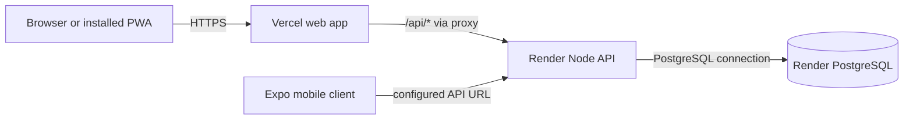

# MediQuick Deployment Guide

## Deployment status

The checked-in files describe an intended production topology of a Vercel web client and API proxy, a Render backend and Render PostgreSQL. They do not confirm the current state, ownership, availability or operational configuration of any live environment.

Repository configuration:

- Root `render.yaml` and `pharmacy-backend/server/render.yaml` define a Render Node web service and PostgreSQL database.
- `pharmacy-inventory/vercel.json` configures service-worker/manifest headers, `/api/*` rewrites and SPA fallback.
- `pharmacy-inventory/api/index.js` forwards web API requests to `BACKEND_API_URL` (falling back to `REACT_APP_API_BASE_URL`).
- Root `Dockerfile` and `pharmacy-inventory/docker-compose.yml` provide an alternate container configuration. Its deployment/maintenance status is not currently documented/verified.
- Mobile app distribution/signing configuration is not currently documented/verified.

## Recommended checked-in topology



The Vercel proxy forwards requests and most headers to the configured backend. Set the backend CORS frontend origin values to the intended web origin. The mobile client calls the backend directly using its configured base URL.

## Backend and database setup

### Required production environment

Configure these values through the deployment provider's environment/secret management:

| Variable | Requirement |
|---|---|
| `NODE_ENV` | `production` |
| `DATABASE_URL` | PostgreSQL connection string; use `<DATABASE_URL>` in documentation/examples. Required by production startup. |
| `JWT_SECRET` | Strong private signing secret; use `<JWT_SECRET>` in documentation/examples. Required by production startup. |
| `PORT` | Supplied by the host when applicable; application defaults to `5001`. |
| `JWT_EXPIRES_IN_HOURS` | Optional token lifetime; code default is `12`. |
| `FRONTEND_URL` | Primary browser origin allowed by backend CORS. |
| `FRONTEND_URLS` | Optional comma-separated additional allowed origins. |
| `ALLOW_VERCEL_PREVIEWS` | Set intentionally; when enabled, HTTPS `*.vercel.app` origins can be accepted. |
| `ENABLE_DEMO_SEEDING` | Keep disabled in production. |

`POSTGRES_URL` is recognized by the Sequelize connection setup as a fallback, but production startup explicitly requires `DATABASE_URL`; configure the latter. Do not set `SQLITE_STORAGE_PATH` or a SQLite URL in production; the backend rejects SQLite production configuration.

The checked-in Render blueprint links the backend to the database named `pharmacy-db`, generates a JWT secret, runs `npm install && npm run migrate` as its build command, uses `npm start` for startup, and checks `/health`. Verify plan, service names, database retention, backups and current provider requirements before applying the blueprint.

### Migrations and initial administrator

Production migrations are invoked by the Render build command. Review migration source and back up the production database before schema changes. Migrations are versioned, but this is not a substitute for testing an upgrade and recovery procedure.

Create the initial admin only through the controlled backend seed command, with `SEED_ADMIN_EMAIL` and `SEED_ADMIN_PASSWORD` supplied securely. The password must be at least 12 characters. The seed script does not reveal default credentials and does not create a second admin if one already exists. Do not put seed credentials into deployment manifests or documentation.

## Web client setup

The Vercel config serves the Create React App build and rewrites `/api/:path*` to the Vercel function. That function requires a backend base URL:

```text
BACKEND_API_URL=<BACKEND_API_BASE_URL>
```

For Vercel production, leave `REACT_APP_API_BASE_URL` unset if using the same-origin `/api` proxy. In local development set `REACT_APP_API_BASE_URL=http://localhost:5001` (or the appropriate local API URL).

The repository README identifies the web package as a Create React App project. Validate the production build with `npm run build` from `pharmacy-inventory` before deployment.

## Mobile configuration

Set `EXPO_PUBLIC_API_URL=<BACKEND_API_BASE_URL>` for non-development mobile builds. In development, the API client attempts to derive a reachable backend URL from Expo host information and Android emulator conventions. Verify network reachability from the actual simulator/device. No app-store signing, release channel or CI deployment process is documented/verified in the repository.

## Alternate Docker assets

The root Dockerfile builds the web bundle and runs the backend in a Node container. The Docker Compose file under `pharmacy-inventory` describes a PostgreSQL service and an app service, requiring `POSTGRES_PASSWORD` and `JWT_SECRET`.

These files are present but are not the topology described by the root Render/Vercel configuration. Before using them, validate their build context, exposed/listening ports, environment, health checks, persistent-volume/backup strategy and migration behavior against the desired environment. Do not treat a Compose database volume as a backup.

## CORS and network requirements

- Backend CORS is configured from `FRONTEND_URL` and `FRONTEND_URLS`, with local development origins allowed outside production.
- Production only accepts configured origins plus Vercel preview origins if `ALLOW_VERCEL_PREVIEWS` permits them.
- Use HTTPS for public clients and backend endpoints.
- Do not open PostgreSQL to the public internet unless the provider's documented network model requires it; restrict access to the application service.

## Release checklist

1. Confirm the intended target and review the checked-in configuration for that target.
2. Verify API build/syntax check and backend tests; build the web client and typecheck mobile if it is in scope.
3. Review schema/data migrations, run them against a disposable PostgreSQL environment, and prepare a tested backup/restore path.
4. Configure `DATABASE_URL`, `JWT_SECRET`, allowed frontend origins and client backend URLs in provider-managed settings.
5. Keep demo seeding and legacy development auth disabled in production.
6. Deploy backend and database, then verify `GET /health`.
7. Deploy the web app and verify `/api/auth/login`, protected API calls, CORS and SPA navigation.
8. Verify mobile connectivity separately if a mobile release is intended.
9. Test one receiving workflow, one sale, movement history, expiry/low-stock analytics and report output with controlled test data.
10. Confirm logs do not expose credentials or customer/patient information.

## Backup and recovery

Production data resides in PostgreSQL, not in browser IndexedDB, the service-worker cache or local storage. Configure provider backups/retention according to operational requirements, restrict access to exported backups, encrypt them at rest and test restoration to a non-production database. No repository-verified backup automation/retention policy was found.

## Environment variable reference

For the broader environment variable list and local setup, see the [README](../README.md#environment-variables). Never commit `.env`, private keys, database URLs, passwords or tokens.
